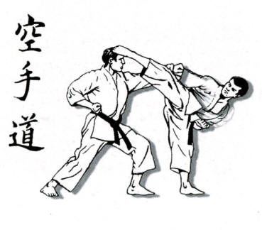
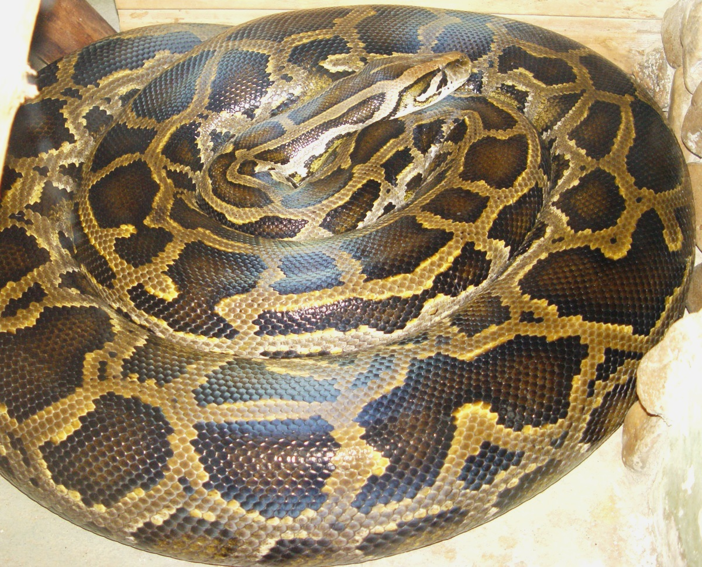

<h1>A brief portfolio of Ivan</h1>

Chapter 1 Karate
---------

> I have begun training Karate at the age of 6 till the age of 18
>> During this period I got good at and I was several years in a row national champion of homeland.
>>> I have brown belt. Unfortunately I do not train Karate anymore.

*if you are interested in this sport you can find more info here:* [Karate](https://en.wikipedia.org/wiki/Karate)
> Nowadays I prefer to do other sports such as:
1. **running** 
2. ***bycicle riding*** 
3. *table tennis*
4. ***paddle boarding***.

Chapter 2 Tourism
-------

+ I have studied tourism in 3 different countries.
        
        I did my bachelors in Bulgaria. While there I when on a Erasmus semester in Portugal where I spent
     ***6 months***
        
        Afterwards I came to Germany to do my masters. I did my studies within 
        
    **2 years***

        Almost immediatly after that I got a job in a call center as a sales agent for
        
    ***BA*** (British airways)

        I worked there for 5 and half years until sadly for many BA closed their operation in Germany and moved their business elsewhere.

Chapter 3 Programming
----

>After long consideration I have decided to get myself into programming. 
>> So what I did was I talked to some friends in that field about it and they gave me some guidance.
>>> Eventually I began a Python course for beginners on [Udemy](www.udemy.org)
> I found it very challanging at the beginning but little by little I understood more of it and finally I started to enjoy it. 

<h3> I am looking forward to what the future holds for me in this field </h3>

<h2>Thank you for your attention</h2>

        
        
        

# Portfolio
# Portfolio
